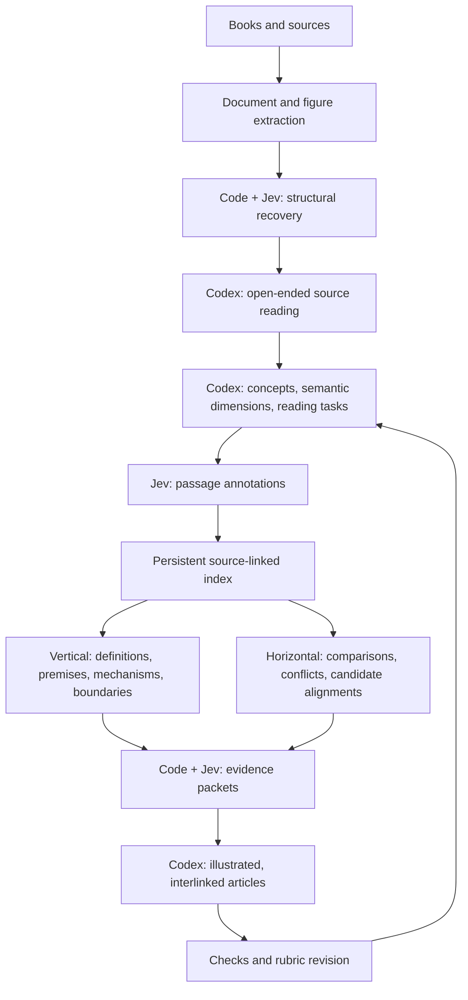

# llm-wiki for Codex + Jev

Maintain a source-linked, interlinked wiki in **Logseq or Obsidian**, using Codex for
reading and synthesis and Jev for repeated semantic judgments during ingestion.
This is a Codex adaptation of [Mehmet Goekce's llm-wiki](https://github.com/MehmetGoekce/llm-wiki),
inspired by [Karpathy's LLM Wiki](https://gist.github.com/karpathy/442a6bf555914893e9891c11519de94f).

The division of work is explicit: **Codex discovers concepts; Jev applies precise
distinctions; Python preserves and assembles evidence; Codex writes the articles.**

## Setup

Requires Python 3, bash, and git. No package installation or separate server.
Run bash on macOS/Linux, WSL, or Git Bash on Windows with Python 3 available.

```bash
git clone https://github.com/X4NDE7/llm-wiki.git
cd llm-wiki
./setup.sh
```

Choose Logseq or Obsidian, the wiki directory, optional non-secret L1 notes, and the
project where you use Codex. Setup creates the schema, dashboard, hub indexes,
access log, and `llm-wiki.yml`. It installs a self-contained skill at
`<project>/.agents/skills/wiki/SKILL.md` and appends a small locator to `AGENTS.md`,
preserving existing instructions. Existing wiki pages are skipped on reruns.

Start Codex in that project and send:

```text
$wiki ingest "your first source"
$wiki query "what do I know about X?"
$wiki lint
```

These are Codex skill invocations, not terminal commands. See the official
[skills documentation](https://learn.chatgpt.com/docs/build-skills) for discovery
and [AGENTS.md documentation](https://learn.chatgpt.com/docs/agent-configuration/agents-md)
for startup instructions.

To update only the installed skill for an existing wiki:

```bash
python3 scripts/install_skill.py --project /path/to/project --config /path/to/wiki/llm-wiki.yml
```

The installed skill includes its workflow references, Python helper, and example
question/task files, so it can run without this checkout. For an older Claude Code
installation, install the Codex skill using the same wiki config; the schema and
articles remain compatible. Add the optional `ingest` settings from
[config.example.yml](config.example.yml). The old slash-command file is unused by
Codex and can be removed by its owner if no longer needed.

## Jev ingestion



The helper supports structural recovery, multidimensional annotation, BM25
shortlisting and Jev reranking, exact-span selection with an answer-exists check,
evidence-role classification, concept/entity alignment, and beam navigation across
multiple facets. Conflicts and uncertain candidates remain available. Scores never
automatically merge articles or establish factual truth.

Jev starts **offline**. Set `TYPESAFE_API_KEY` in the environment and change
`ingest.jev.live` to `true` in `llm-wiki.yml` to enable API calls. Without live mode,
the helper preserves sources and records pending judgments; Codex can still read
and synthesize with that limitation stated. Jev receives text passages, not images.
PDF/OCR and figure extraction use the document tools available to Codex.

See [the ingestion guide](docs/jev-ingestion.md) for runnable commands, artifact
formats, API contracts, limitations, and a book-validation protocol. The included
synthetic tests validate software behavior; they are not a Jev accuracy benchmark.

## Commands

| Skill request | Behavior |
|---|---|
| `$wiki ingest <source>` | Read a source, build evidence, create/update articles and hub routing lines |
| `$wiki query <question>` | Route through hub indexes, read at most 3 full pages at a time, cite sources |
| `$wiki lint [--fix]` | Check links, properties, staleness, routing drift, credentials, and provenance |
| `$wiki status` | Report wiki health, access activity, and ingestion coverage |
| `$wiki import` | Convert existing notes to the configured wiki format |
| `$wiki prune [--months N]` | Move cold pages out of live hub indexes without deleting articles |
| `$wiki prune --l1` | Review dated behavior claims in configured L1 notes |

## L1 and L2

| Layer | Content | Loading |
|---|---|---|
| L1 | Short rules, preferences, identity, credential references | Applicable `AGENTS.md` is loaded by Codex; optional rule-note files are explicitly read |
| L2 | Articles, projects, research, source interpretations | Read on demand through hub routing and source indexes |

Codex does **not** automatically load arbitrary files under `memory_path`. That
optional directory contains rule notes managed by this toolkit. Keep essential
startup rules in `AGENTS.md`; store actual credentials in environment variables or
a secret manager. Never put API keys in instructions or wiki content.

[Architecture](docs/l1-l2-architecture.md) ? [Schema](docs/schema-reference.md) ?
[Logseq vs. Obsidian](docs/logseq-vs-obsidian.md) ? [FAQ](docs/faq.md) ?
[Troubleshooting](docs/troubleshooting.md)

## Development

```bash
python3 -m unittest discover -s tests -v
```

Tests exercise source fidelity, uncertainty, API response validation, retrieval,
and installation in both wiki formats. See [CONTRIBUTING.md](CONTRIBUTING.md).
Personal source/index/run artifacts belong in git-ignored `.wiki-ingest/`.
The public repository contains the toolkit and synthetic examples.

MIT ? preserve the upstream attribution and [LICENSE](LICENSE).
